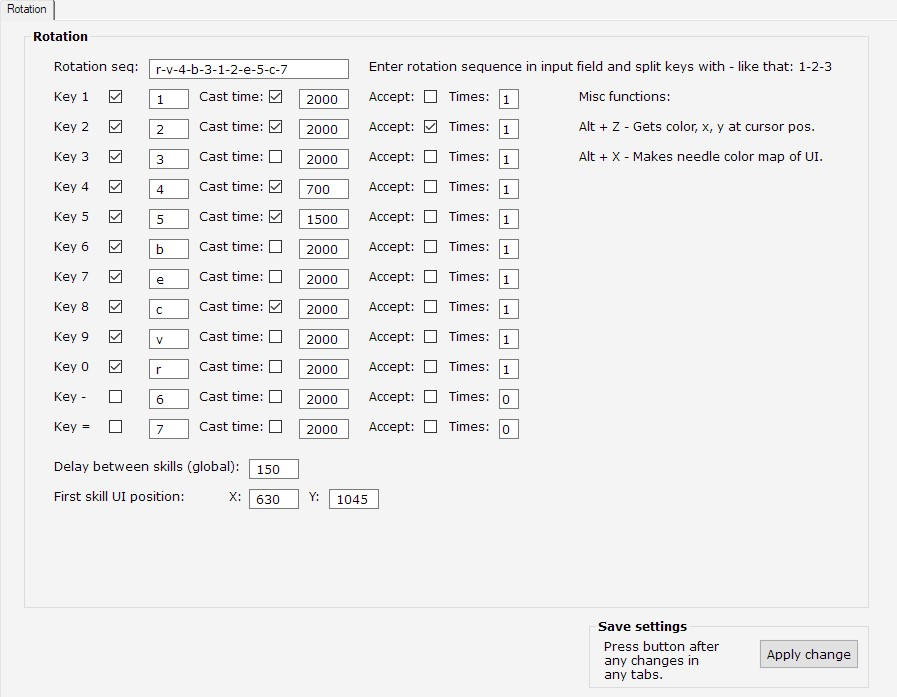

## Требования:
    - AutoHotkey v1.1+

    

- Интерфейс:
    - Rotation seq ввод ротации скиллов (определяет первичный порядок прожатия)
    - Key N [V] [ 1 ] - Активация и сопоставление кнопки умения и бинда
    - Cast time [V] [2000] - Время каста скилла (длительность удержания кнопки)
    - Needle [0xFFF000] X: [111] Y: [222] - Цвет пикселя и координаты для проверки (если
      изменился значит скилл в кд или не может быть применён) позволяет избегать ложных нажатий
    - Accept: [V] Times: [1] - Нужно ли скиллу подтверждение для применения и кол-во нажатий на
      скилл.
    - Delay between skills (global): [200] - Задержка между прожатием каждой кнопки
    - [Apply change] - Кнопка для сохранения любого внесённого изменения
- Макрос:
    - Интерфейс
        - Ввод для ротации
        - Кнопки 1-12
            - Активация кнопки
            - Ввод кнопки
            - Ввод времени каста
            - Цвет иглы
            - Ввод координат иглы
            - Подтверждение использования скилла
            - Кол-во использований скилла подряд
        - Базовая задержка между нажатием кнопок (global delay)
        - Забив каждой "иглы" оказался не рабочим, любое изменение UI и всё ломается
          так же без изменения UI скрип перестал работать (цвет игл не совпал).
          Новый способ - создание маски панели в авто режиме, нужно лишь ввести x y
          для первого скилла, далее автоматом возьмёт инфу о всех иглах.
        - Слегка уменьшить?  
    - Ф-ции
        - Общий алгоритм
            - При нажатии триггер клавиши активируем цикл в котором происходят
              проверки на состояния клавиш. Получаем состояния клавиш %key1_state%
              писать/читать их не ненужно (удалить переменные).
            - Порядок проверки клавиши и соотв. порядок в котором они попадут
                в очередь берём из %rotation_key_set% которую ввели в UI,
                добавлять в очередь можно лишь клавиши с не активным состоянием.
            - Формируем очередь обновляем состояние готовности клавиши в ассоциативном
                массиве.
            - В базовом варианте формируем очередь из ротации введённой в UI. 
                В продвинутом используем очередь с приоритетом.
                - Очередь сформирована, в ней есть клавиши, формируем объект вида:
                    ключ: [
                        цвет, цвет_х, цвет_у,
                        статус_каста,
                        время_каста,
                        статус отката,
                        активность (вкл/выкл),
                        подтверждение прожатия,
                        кол-во повторных прожатий
                    ]
                - Первая клавиша прожимается и удаляется из очереди, обновляется
                    её состояние в ассоциативном массиве возвращаемся в начало цикла.
                - Второй цикл с проверкой состояния клавиш, в базовом варианте откатившиеся
                    добавляется в конец очереди, в продвинутом добавляются в очередь с учётом
                    приоритета.
        - Проверка и нажатие клавиши
            - Скиллы с множественным нажатием лучше прожимать удерживанием (Cast time 
              подошёл отлично), многократные нажатия показали себя не очень
            - Применение с подтверждением (метеора)
        - Улучшения
            - Профили (быстрая смена переменных под разные классы)
            - Очередь
                - Базовая версия - просто жать по очереди
                - Продвинутая - очередь с приоритетом (двоичная куча)
